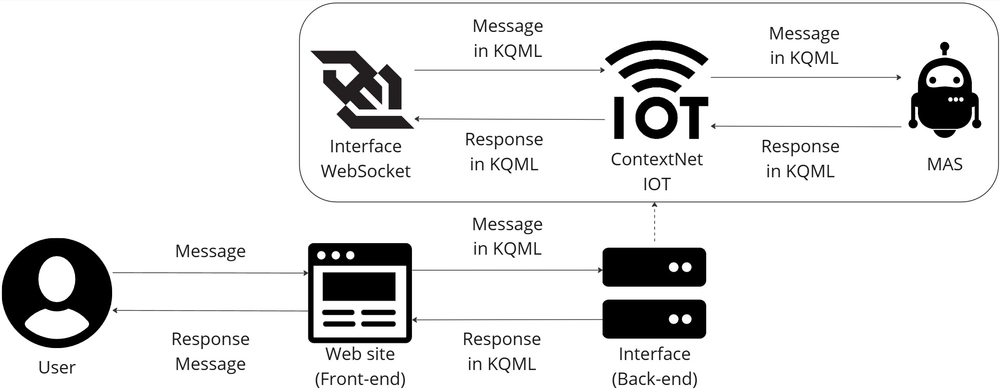

# ContextNet App - Interface de Comunicação Humano-Agente

<div align="center">
  
  
  
  
</div>

## Sobre o Projeto

O **ContextNet App** é uma aplicação web desenvolvida como parte do Trabalho de Conclusão de Curso (TCC) do curso de Sistemas de Informação. Esta aplicação serve como interface frontend para comunicação entre humanos e agentes inteligentes através da rede ContextNet, utilizando o protocolo KQML (Knowledge Query and Manipulation Language).

### Objetivo

Facilitar a interação entre usuários e sistemas multi-agentes (SMA) através de uma interface web intuitiva e responsiva, permitindo o controle e monitoramento de dispositivos IoT por meio de comandos KQML.

## Funcionalidades

### Principais Características

- **Interface Responsiva**: Design adaptável para desktop, tablet e dispositivos móveis
- **Tema Claro/Escuro**: Alternância entre temas com detecção automática da preferência do sistema
- **Leitura de QR Code**: Scanner integrado para configuração rápida via QR Code (mobile)
- **Chat em Tempo Real**: Interface de chat para comunicação com agentes inteligentes
- **Protocolo KQML**: Suporte completo aos comandos tell, askOne, askAll, tellHow e achieve
- **Monitoramento de Agentes**: Visualização de dados e status do agente conectado
- **Ações Pré-definidas**: Lista de comandos KQML comuns para facilitar o uso
- **Persistência de Dados**: Armazenamento local das configurações de conexão

### Tecnologias Utilizadas

#### Frontend
- **Next.js 15**: Framework React com App Router
- **TypeScript**: Tipagem estática para maior robustez
- **Material-UI (MUI) 5.15**: Biblioteca de componentes React
- **Tailwind CSS**: Framework CSS utilitário

#### Funcionalidades Específicas
- **html5-qrcode**: Leitura de QR codes via câmera
- **cookies-next**: Gerenciamento de cookies

## Arquitetura do Sistema



### Estrutura do Projeto

```
contextnet-app/
├── app/                    # App Router do Next.js
│   ├── chat/              # Página de chat
│   ├── globals.css        # Estilos globais
│   ├── layout.tsx         # Layout principal
│   └── page.tsx           # Página inicial
├── components/            # Componentes React
│   ├── ui/               # Componentes base (shadcn/ui)
│   ├── agent-data.tsx    # Exibição de dados do agente
│   ├── chat-input.tsx    # Input de chat com KQML
│   ├── chat-interface.tsx # Interface principal do chat
│   ├── footer.tsx        # Rodapé da aplicação
│   ├── landing-page.tsx  # Página de login/configuração
│   ├── message-bubble.tsx # Bolhas de mensagem
│   ├── mode-toggle.tsx   # Alternador de tema
│   ├── qr-scanner.tsx    # Scanner de QR code
│   ├── snackbar-provider.tsx # Provider de notificações
│   └── theme-provider.tsx # Provider de tema
├── contexts/             # Contextos React
│   └── key-context.tsx   # Contexto de dados de conexão
├── hooks/                # Hooks customizados
│   ├── use-hydration.ts  # Hook de hidratação
│   ├── use-mobile.ts     # Detecção de dispositivo móvel
│   └── use-toast.ts      # Hook de notificações
├── lib/                  # Utilitários
│   └── utils.ts          # Funções auxiliares
└── public/               # Arquivos estáticos
```

## Instalação e Configuração

### Pré-requisitos

- Node.js 18+ 
- npm ou yarn
- Git

### 1. Clone o Repositório

```bash
git clone https://github.com/gustavoxav/AgentChat.git
cd agentchat
```

### 2. Instale as Dependências

```bash
npm install
# ou
yarn install
```

### 3. Execute o Projeto

#### Desenvolvimento
```bash
npm run dev
# ou
yarn dev
```

#### Produção
```bash
npm run build
npm start
# ou
yarn build
yarn start
```

### 4. Acesse a Aplicação

- **Desenvolvimento**: [http://localhost:3000](http://localhost:3000)
- **Produção**: [https://agent-chat-iota.vercel.app](https://agent-chat-iota.vercel.app)

## Como Usar

### 1. Configuração Inicial

1. Acesse a aplicação
2. Preencha os dados de conexão:
   - **IP da Rede ContextNet**: Endereço do servidor ContextNet
   - **Porta**: Porta de comunicação (padrão: 5500)
   - **UUID do Agente**: Identificador único do agente
   - **UUID do Usuário**: Identificador único do usuário (gerado automaticamente)

### 2. Configuração via QR Code (Mobile)

1. Toque em "Ler QR Code"
2. Posicione a câmera sobre o QR code
3. Os dados serão preenchidos automaticamente

**Formato do QR Code:**
```json
{
  "ip": "192.168.1.100",
  "porta": "5500",
  "uuidAgent": "agent-uuid-here",
  "uuidAPP": "app-uuid-here"
}
```

### 3. Comunicação com Agentes

1. Após o login, acesse a interface de chat
2. Selecione o tipo de comando KQML:
   - **TELL**: Informar algo ao agente
   - **ASK**: Solocitar o retorno do últumo registro de determinada expressão
   - **ASKAll**: Solocitar todo o retorno de uma determinada expressão
   - **TELLHOW**: Ensinar uma determinada expressão ao agente
   - **ACHIEVE**: Solicitar uma ação ao agente
3. Digite o comando ou selecione uma ação pré-definida
4. Envie a mensagem e aguarde a resposta do agente

### 4. Exemplos de Comandos KQML

```kqml
Tell:
<mid1,641f18ae-6c0c-45c2-972f-d37c309a9b72,tell,cc2528b7-fecc-43dd-a1c6-188546f0ccbf,numeroDaSorte(63626)>

AskOne:
<mid2,641f18ae-6c0c-45c2-972f-d37c309a9b72,askOne,cc2528b7-fecc-43dd-a1c6-188546f0ccbf,numeroDaSorte(N)>

AskAll:
<mid3,641f18ae-6c0c-45c2-972f-d37c309a9b72,askAll,cc2528b7-fecc-43dd-a1c6-188546f0ccbf,numeroDaSorte(N)>

Achieve:
<mid4,641f18ae-6c0c-45c2-972f-d37c309a9b72,achieve,cc2528b7-fecc-43dd-a1c6-188546f0ccbf,plano(teste)>

TellHow:
<mid5,641f18ae-6c0c-45c2-972f-d37c309a9b72,tellHow,cc2528b7-fecc-43dd-a1c6-188546f0ccbf, "+!ensinamento(J)[source(Origem)] <- .print(\"Recebi o plano: \",J,\" \",Origem).">
```

## Testes

```bash
# Executar testes unitários
npm test

# Executar testes com cobertura
npm run test:coverage

# Executar testes e2e
npm run test:e2e
```

## Contribuição

### Como Contribuir

1. Fork o projeto
2. Crie uma branch para sua feature (`git checkout -b feature/AmazingFeature`)
3. Commit suas mudanças (`git commit -m 'Add some AmazingFeature'`)
4. Push para a branch (`git push origin feature/AmazingFeature`)
5. Abra um Pull Request

### Padrões de Código

- **ESLint**: Linting automático
- **Prettier**: Formatação de código
- **TypeScript**: Tipagem obrigatória
- **Conventional Commits**: Padrão de commits

## Licença

Este projeto está sob a licença MIT. Veja o arquivo [LICENSE](LICENSE) para mais detalhes.

## Equipe

### Desenvolvedores
- **Nome**: Gustavo Xavier Saldanha e Mateus Façanha Lima de Souza
- **Curso**: Sistemas de Informação
- **Instituição**: CEFET/RJ Campus Nova Friburgo
- **Email**: gustavosaldxav@gmail.com e facanhalima85@gmail.com
- **LinkedIn**: [https://github.com/gustavoxav](https://github.com/gustavoxav) e [https://github.com/gustavoxav](https://github.com/gustavoxav) 

### Orientador
- **Prof. Dr.**: Nilson Mori Lazarin
- **Email**: [nilsonmori@gmail.com](nilsonmori@gmail.com)

## Referências Acadêmicas

1. **KQML Specification**: Knowledge Query and Manipulation Language
2. **Multi-Agent Systems**: Foundations and Applications
3. **IoT Communication Protocols**: A Comprehensive Survey
4. **Human-Computer Interaction**: Design Principles

## Links Úteis

- **Aplicação em Produção**: [https://agent-chat-iota.vercel.app/](https://agent-chat-iota.vercel.app/)
- **Repositório Backend**: [https://github.com/gustavoxav/contextNetChat-api](https://github.com/gustavoxav/contextNetChat-api)
- **Documentação do Projeto**: [https://](https://)

## Roadmap

### Versão 1.1 (Próximas Features)
- [ ] Histórico de conversas
- [ ] Notificações push
- [ ] Múltiplos agentes simultâneos

---

<div align="center">
  <p>Desenvolvido para o TCC de Sistemas de Informação</p>
  <p>© 2025</p>
</div>
```
